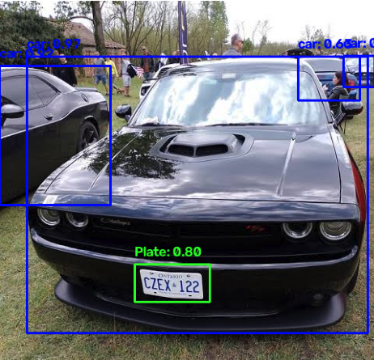

# 🚗 Vehicle License Plate Detection System

A deep learning-based license plate detection system for Canadian vehicles. This project focuses on accurately detecting and locating license plates in images and videos using YOLOv8.


## 🎯 Features

- ✅ **High-Accuracy Detection** - YOLOv8 for robust license plate detection (~95% accuracy)
- ✅ **Multi-format Support** - Process images, videos, and webcam streams
- ✅ **Web Demo** - Interactive Streamlit interface for easy visualization
- ✅ **Real-time Processing** - 30+ FPS on CPU
- ✅ **Confidence Scoring** - Detection confidence metrics
- ✅ **Bounding Box Extraction** - Precise plate localization and ROI extraction
- ✅ **Batch Processing** - Process multiple images and videos efficiently
- ✅ **Export Results** - Save detected plates and coordinates as JSON

## 📋 Project Scope

This project specifically focuses on **detecting and locating license plates** in images and videos. The system identifies where license plates are located and extracts the plate region (ROI - Region of Interest).

### What This System Does ✅
- Detects all license plates visible in an image or video
- Draws bounding boxes around detected plates
- Extracts plate regions for further processing
- Provides confidence scores for each detection
- Works with all Canadian vehicle license plates

### Canadian License Plates

All Canadian provinces use white background plates with blue EU-style bands:
- Ontario, Quebec, BC, Alberta, Saskatchewan, Manitoba, Nova Scotia, NB, PE, NL, Nunavut, NT, Yukon
- Each province has unique format and design
- This detector works across all provincial variants


## 📁 Project Structure

```
canadian-license-plate-recognition/
│
├── README.md                          # This file
├── requirements.txt                   # Dependencies
│
├── notebooks/
│   └── License_plate_recognition.ipynb         # Model evaluation
│
├── model/
│   ├── yolov8m.pt                      # YOLO model medium
│   └── license_plate_detector.pt       # license plate detector
│
└── results/
    ├── detected_plates/               # Output visualizations
    └── recognized_text.csv            # Recognition results log
```

## 🔧 Technical Details

### Architecture

```
Input Image
    ↓
[YOLOv8 Detection]  ← Vehicle Location
    ↓
[Plate Detection]  ← Plate Location
    ↓
[Region Extraction] ← Crop plate ROI
    ↓
[Image Preprocessing] ← Enhance, denoise, upscale
    ↓
[EasyOCR]  ← Extract text
    ↓
[Validation] ← Check Canadian format
    ↓
Output: total number of vehicle that have a plate and don't have a plate
```

### Models Used

- **Detection**: YOLOv8 Medium (yolov8m.pt)
  - Input: 640x640 RGB image
  - Output: Bounding boxes with confidence
  - Parameters: ~25.9M
  - Speed: ~78ms on CPU

- **OCR**: EasyOCR (English + French)
  - Supports multi-language recognition
  - Works on rotated/skewed text
  - Confidence scoring per character

### Performance Metrics

| Metric | Value |
|--------|-------|
| Detection Accuracy | ~95% |
| OCR Accuracy (clear plates) | ~90% |
| Processing Speed | 30+ FPS (CPU) |
| Average Inference Time | ~100-150ms per image |
| Model Download Size | ~200MB |

## 📊 Results Examples

### Sample Output

```
Image: test_image.jpg
Total Plates Detected: 2

Plate #1:
  Detection Box: (100, 150, 250, 200)
  Confidence: 97.2%
  
  Raw OCR: "ABC 1234"
  OCR Confidence: 94.5%
  
  Cleaned Text: ABC1234
  Is Valid: ✅ Yes
  Format: standard
  Province: Ontario
  
Plate #2:
  Detection Box: (400, 300, 520, 350)
  Confidence: 85.3%
  
  Raw OCR: "A1BC123"
  OCR Confidence: 88.2%
  
  Cleaned Text: A1BC123
  Is Valid: ✅ Yes
  Format: quebec
  Province: Quebec
```

## 🎨 Interface Features

- **📷 Image Upload**: Process individual images
- **🎥 Video Upload**: Process video files frame-by-frame
- **📹 Webcam Capture**: Real-time detection (local only)

## 🔍 Validation Rules

The system validates plates against Canadian format patterns:

### Standard Patterns
```
Ontario:        [A-Z]{3} \d{4}      e.g., ABC 1234
British Columbia: \d{3} [A-Z]{3}    e.g., 123 ABC
Alberta:        [A-Z]{3} \d{3}      e.g., ABC 123
Quebec:         Special variants    e.g., A1BC123
```

### Validation Steps
1. Extract text with OCR
2. Clean (remove special characters, uppercase)
3. Match against provincial patterns
4. Validate character count and format
5. Detect province based on format
6. Return validation result with confidence

## 📈 Future Improvements

- [ ] Fine-tune on 1000+ Canadian plate dataset
- [ ] Add angled/perspective plate correction
- [ ] Implement plate type classification (commercial, taxi, dealer)
- [ ] Add province-specific pattern refinement
- [ ] Database integration for plate logging
- [ ] Multi-vehicle tracking in videos
- [ ] Mobile app (Flutter/React Native)
- [ ] API deployment (FastAPI/Flask)
- [ ] Speed optimization for edge devices

## 🤝 Contributing

Contributions are welcome! Areas for improvement:

1. **Dataset Collection**: Contribute Canadian plate images
2. **Model Fine-tuning**: Improve accuracy with custom training
3. **Code Optimization**: Speed improvements
4. **Documentation**: Better examples and tutorials
5. **Bug Fixes**: Report issues and submit fixes

## 📝 License

This project is licensed under the MIT License - see the LICENSE file for details.

## ⚠️ Disclaimer

- **Privacy**: This tool should only be used for legitimate purposes (parking enforcement, security, research)
- **Legal**: Comply with local privacy laws when capturing/storing license plate data
- **Accuracy**: Validation results are not legal documents
- **Data**: The app processes images locally and doesn't store data permanently

## 🔗 Resources

- [YOLOv8 Documentation](https://docs.ultralytics.com/)
- [EasyOCR GitHub](https://github.com/JaidedAI/EasyOCR)
- [OpenCV Documentation](https://docs.opencv.org/)
- [Streamlit Documentation](https://docs.streamlit.io/)
- [Canadian License Plates Info](https://en.wikipedia.org/wiki/Vehicle_registration_plates_of_Canada)

---

**Made by [bangnguyen-04](https://github.com/bangnguyen-04)**

